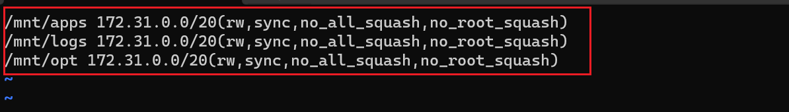

# DevOps-Tooling-Website-Solution
n previous project [Implementing Web Solution https://github.com/Divinepj/Implementing-Wordpress-Web-Solution] I implemented a WordPress based solution that is ready to be filled with content and can be used as a full fledged website or blog. Moving further I will add some more value to my solution so that a member of a DevOps team could utilize.

In this project,, I will be introducing the concept of file sharing for multiple servers to share the same web content and also a database for storing data related to the website using **RHEL-8.6.0_HVM-20220503-x86_64-2-Hourly2-GP2** 


## STEP 1 Preparing NFS Server
Create an EC2 instance (Red Hat Enterprise Linux 8 on AWS) on which we will setup our NFS(Network File Storage) Server.

On this server we attach 2 EBS volumes 10GB each as external storage to our instance and create 3 logical volumes on it through which we will attach mounts from our external web servers.

-   3 logical volumes lv-opt, lv-apps and lv-logs
-   3 mount directory /mnt/opt, /mnt/apps and /mnt/logs
-   Webserver content will be stores in /apps, webserver logs in /logs and /opt will be used by Jenkins

We first create the logigal volumes and `xfs` file systems as shown below
 and 

we therefore proceed to create directories `/mnt/apps`, `/mnt/opt`, and `/mnt/logs`

we then mount this on the logical volumes as shown below 

we then proceed to install the NFS server by running the following commands 
```
{
sudo yum -y update
sudo yum install nfs-utils -y
sudo systemctl start nfs-server.service
sudo systemctl enable nfs-server.service
sudo systemctl status nfs-server.service
}
```


we then make sure that the the permissions that will allow our web servers to read, write and execute file on NFS by running the commands below 
```
{
sudo chown -R nobody: /mnt/apps
sudo chown -R nobody: /mnt/logs
sudo chown -R nobody: /mnt/opt

sudo chmod -R 777 /mnt/apps
sudo chmod -R 777 /mnt/logs
sudo chmod -R 777 /mnt/opt

sudo systemctl restart nfs-server.service
}
```


we then configure access to NFS for clients within the same subnet CIDR. we get the subnet cidr on the AWS web console as by running the command below `sudo vi /etc/exports` shown below 

we add the following to the configuration file as shown below
```
{
/mnt/apps <Subnet-CIDR>(rw,sync,no_all_squash,no_root_squash)
/mnt/logs <Subnet-CIDR>(rw,sync,no_all_squash,no_root_squash)
/mnt/opt <Subnet-CIDR>(rw,sync,no_all_squash,no_root_squash)
}
```



and `sudo exportfs -arv` as shown below 

we then check the which port is used by NFS and open it using security groups by running the commands 


## Preparing Database Server

Create an Redhat Server on AWS which will serve as our Database. Ensure its in the same subnet as the NFS-Server.

we then proceed to Install mysql-server by running the commands below 
```
{
sudo apt -y update
sudo apt install -y mysql-server
sudo systemctl start mysql
sudo systemctl enable mysql
sudo systemctl status mysql
}
```


We then create a database and name it tooling, create a database user and name it webaccess and grant permission to webaccess user on tooling database to do anything only from the webservers subnet cidr by running the commands 
```
{
sudo mysql
CREATE DATABASE tooling;
CREATE USER `webaccess`@`<subnet cidr>` IDENTIFIED BY 'mypass';
GRANT ALL ON tooling.* TO 'webaccess'@'<subnet cidr>';
FLUSH PRIVILEGES;
SHOW DATABASES;
SELECT User FROM mysql.user;
}
```
as shown below 

## Preparing Web Servers

Create a RHEL EC2 instance on AWS which serves as our web server. Also remember to have in it in same subnet

A couple of configurations will be done on the web servers:

- configuring NFS client
- deploying tooling website application
- configure servers to work with database
Installing NFS-Client


We will then connect our `/var/www` directory to our webserver with the `/mnt/apps` on nfs server. This is acheived by mounting the NFS server directory to the webserver directory by running ``sudo mount -t nfs -o rw,nosuid <NFS private IP>:/mnt/logs /var/log/httpd` as shown below


 

We then ensure that our mounts remain intact when the server reboots. This is achieved by configuring the fstab directory by running the `sudo vi /etc/fstab` 
add the following line <NFS-Server-Private-IP-Address>:/mnt/apps /var/www nfs defaults 0 0 as shown below 

## Installing Apache and Php
we then run the following commands to install both Apache and PHP 
```
{
sudo yum install httpd -y

sudo dnf install https://dl.fedoraproject.org/pub/epel/epel-release-latest-8.noarch.rpm

sudo dnf install dnf-utils http://rpms.remirepo.net/enterprise/remi-release-8.rpm

sudo dnf module reset php

sudo dnf module enable php:remi-7.4

sudo dnf install php php-opcache php-gd php-curl php-mysqlnd

sudo systemctl start php-fpm

sudo systemctl enable php-fpm

setsebool -P httpd_execmem 1
}
```
We can see that both /var/www and /mnt/apps contains same content. This shows that both mount points are connected via NFS. 
 and 
 

We locate the log folder for Apache on the Web Server and mount it to NFS server’s export for logs. Make sure the mount point will persist after reboot by running and `sudo mount -t nfs -o rw,nosuid <NFS private IP>:/mnt/logs /var/log/httpd` as shown below


On the NFS Server, add web content into the /mnt/apps directory. This should contain a html folder. The same content will be present in the /var/www directory in the web server. 

Run <public_ip_address>/index.php on a web browser to access the site. Use public_ip_address of the web server. TCP port 80 should be open on the web broswer as shown below 

In the /var/www/html directory , edit the already written php script to connect to the database `sudo vi /var/www/html/functions.php` 

After the modification , connect to the database server from the web server by running `mysql -h <databse-private-ip> -u <db-username> -p <db-pasword> < tooling-db.sql` as shown below 